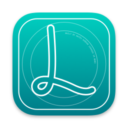

# LottieViewer for Mac

LottieViewer is a macOS application that allows you to view and play Lottie and DotLottie animation files.

## Features

- View Lottie Lottie JSON and DotLottie animations.
- Preview animations using QuickLook.
- Preview using both [original library from AirBnb](https://github.com/airbnb/lottie-ios)
  and alternative [DotLottie library from LottieFiles](https://github.com/LottieFiles/dotlottie-ios).
- Display detailed information about the animation.
- Document based native Swift app.

## Installation

1. Download the latest release from the [Releases](https://github.com/mkj-is/LottieViewerMac/releases) page.
2. Unzip the file and run the application.

## Requirements

- macOS 14+
- Xcode 15+

## Building

1. Clone the repository.
2. Install dev dependencies using `brew bundle` command.
3. Open project in Xcode.
3. Run the project.

## Contributing

All contributions are welcome.

Project was created by [Matěj Kašpar Jirásek](https://github.com/mkj-is).

Project is licensed under [Apache 2.0 license](LICENSE).
